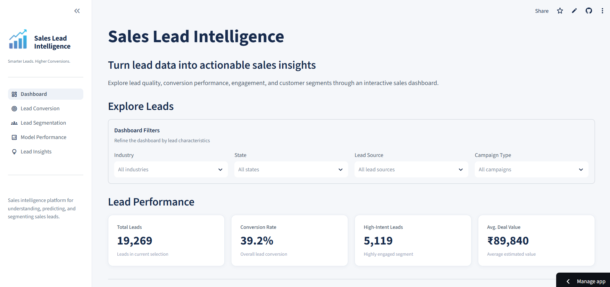
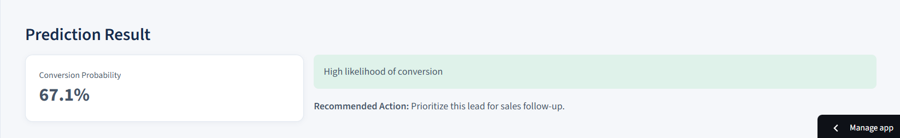
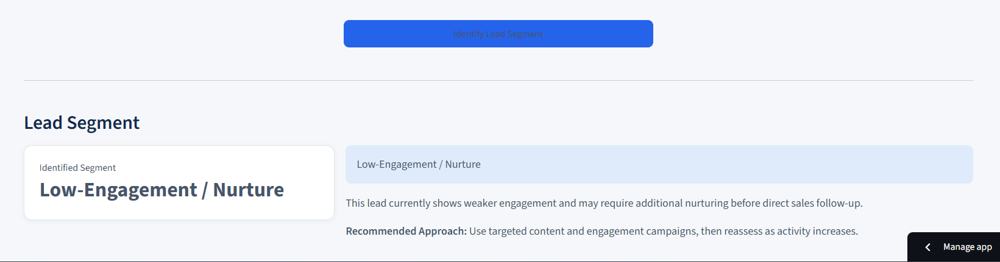
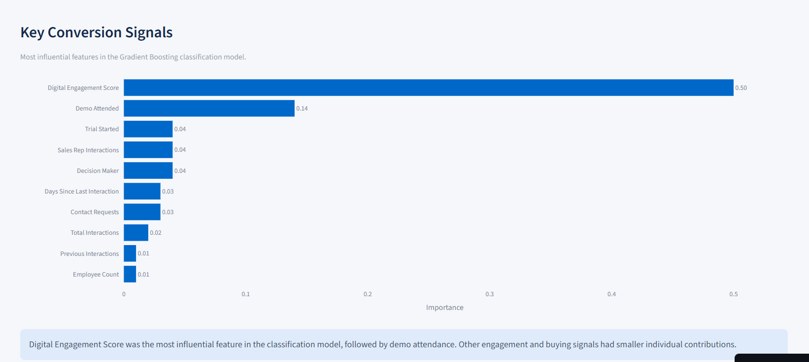
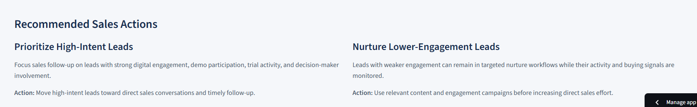

# Sales Lead Intelligence

> An end-to-end machine learning system for predicting lead conversion and segmenting sales leads based on engagement, company profile, and buying behavior.

---

## 📌 Project Overview

**Sales Lead Intelligence** is an end-to-end machine learning project designed to help sales teams identify promising prospects, estimate conversion likelihood, and understand different types of leads.

The project combines **data cleaning, exploratory data analysis, feature engineering, supervised machine learning, unsupervised learning, and an interactive Streamlit application** to transform raw lead data into actionable sales insights.

The solution focuses on two complementary machine learning problems:

- **Lead Conversion Prediction** — Predict whether a lead is likely to convert.
- **Lead Segmentation** — Group leads into meaningful behavioral segments based on engagement and buying characteristics.
  
---

## 🚀 Live Application

Explore the interactive **Sales Lead Intelligence** application:

👉 **[Open Live Streamlit App](https://sales-lead-intelligence-e2tsbvdrap6mh7rs93ocdt.streamlit.app/)**

The application provides interactive lead conversion prediction, lead segmentation, model performance evaluation, and business insights.

---

## 🎯 Business Problem

Sales teams often manage a large number of leads with different levels of engagement, company potential, and buying intent.

Without a systematic approach, it can be difficult to:

- Identify leads that deserve immediate sales attention
- Estimate which leads are more likely to convert
- Understand differences in lead behavior
- Prioritize sales follow-ups
- Determine which leads require continued nurturing

This project addresses these challenges by combining **conversion prediction** with **behavioral lead segmentation**.

---

## 🎯 Project Objectives

1. Analyze lead characteristics and conversion behavior.
2. Identify important factors associated with lead conversion.
3. Engineer meaningful features from raw lead attributes.
4. Build a machine learning model to predict conversion probability.
5. Segment leads according to engagement and buying behavior.
6. Translate model outputs into practical sales actions.
7. Develop an interactive Streamlit application for business users.

---

## 🔄 Project Workflow

```text
Raw Lead Data
      │
      ▼
Data Cleaning & EDA
      │
      ▼
Feature Engineering
      │
      ├───────────────┐
      ▼               ▼
Classification     Clustering
      │               │
      ▼               ▼
Conversion        Lead Segments
Prediction            │
      │               │
      └───────┬───────┘
              ▼
      Business Insights
              │
              ▼
      Streamlit Application
              │
              ▼
      GitHub + Cloud Deployment
```

---

## 🛠️ Technology Stack

| Category | Tools |
|---|---|
| Programming | Python |
| Data Analysis | Pandas, NumPy |
| Visualization | Plotly |
| Machine Learning | Scikit-learn, XGBoost |
| Classification | Logistic Regression, Decision Tree, Random Forest, Gradient Boosting, XGBoost |
| Clustering | K-Means |
| Dimensionality Reduction | PCA |
| Model Persistence | Joblib |
| Application | Streamlit |
| Development | Jupyter Notebook, VS Code |
| Version Control | Git & GitHub |

---

## 📊 Dataset

The project dataset contains **19,269 lead records** and **28 variables** covering lead profile, acquisition, engagement, company characteristics, and buying signals.

### Key Data Categories

- Lead information
- Industry and geographic information
- Lead source and campaign type
- Website and product engagement
- Email engagement
- Sales representative interactions
- Company size
- Estimated budget
- Estimated deal value
- Demo attendance
- Trial activity
- Decision-maker involvement
- Conversion outcome

### Data Preparation

The data preparation process included:

- Duplicate detection and removal
- Missing-value analysis
- Categorical data standardization
- Outlier analysis
- Data consistency checks
- Feature engineering
- Model-ready preprocessing

---

# 🔍 Exploratory Data Analysis

The exploratory analysis was used to understand lead behavior and identify relationships between lead characteristics and conversion.

### Key Findings

**Lead engagement showed a strong relationship with conversion.**

Several engagement variables showed positive relationships with the conversion target:

| Feature | Correlation with Conversion |
|---|---:|
| Website Visits | 0.42 |
| Pages Viewed | 0.39 |
| Content Downloads | 0.37 |
| Product Page Visits | 0.35 |
| Previous Interactions | 0.30 |
| Contact Requests | 0.28 |

Other notable relationships included:

- Website Visits and Pages Viewed: **0.93**
- Website Visits and Product Page Visits: **0.84**
- Website Visits and Content Downloads: **0.82**
- Estimated Budget and Estimated Deal Value: **0.94**
- Employee Count and Estimated Budget: **0.83**

Industry-level conversion rates also varied across lead groups, with IT Services and Telecommunications showing relatively higher observed conversion rates in the dataset.

---

# ⚙️ Feature Engineering

Feature engineering was used to transform raw lead attributes into meaningful variables that better represent **engagement intensity, interaction frequency, company scale, and buying value**.

The engineered features were used across the classification and clustering workflows.

## 1. Total Interactions

Combined previous interactions with sales representative interactions to represent the overall number of recorded interactions with a lead.

```python
Total_Interactions =
    Previous_Interactions + Sales_Rep_Interactions
```

This provides a broader measure of lead interaction activity.

---

## 2. Digital Engagement Score

A composite engagement score was created from multiple digital activity variables:

- Website Visits
- Pages Viewed
- Email Clicks
- Content Downloads
- Product Page Visits

Each feature was normalized against a defined business-oriented maximum and capped at 1 before calculating the average.

```python
normalized_feature = (feature / limit).clip(upper=1)

Digital_Engagement_Score =
    mean(normalized engagement features) × 100
```

The resulting score provides a single measure of overall digital engagement.

---

## 3. Company Size

Company size was derived from **Employee Count** using business-oriented size categories:

| Employee Count | Company Size |
|---:|---|
| 1–50 | Small |
| 51–250 | Medium |
| 251–1,000 | Large |
| 1,001–5,000 | Enterprise |

This transformed a continuous employee count into an interpretable categorical business attribute.

---

## 4. Budget per Employee

Estimated budget was divided by employee count to create a normalized measure of budget relative to company size.

```python
Budget_per_Employee =
    Estimated_Budget / Employee_Count
```

This helps provide additional context around the estimated budget of companies with different workforce sizes.

---

## 5. Deal-to-Budget Ratio

Estimated deal value was compared with estimated budget to create a relative deal-value measure.

```python
Deal_to_Budget_Ratio =
    Estimated_Deal_Value / Estimated_Budget
```

This feature provides additional context about the relationship between the expected deal value and the estimated budget.

Zero-budget cases were handled during application prediction to prevent division-by-zero errors.

---

### Engineered Feature Summary

| Feature | Purpose |
|---|---|
| `Total_Interactions` | Measures overall lead interaction activity |
| `Digital_Engagement_Score` | Represents overall digital engagement |
| `Company_Size` | Categorizes companies by employee count |
| `Budget_per_Employee` | Normalizes estimated budget by company size |
| `Deal_to_Budget_Ratio` | Compares estimated deal value with estimated budget |

These engineered features helped transform individual raw attributes into business-oriented measures that could be used by the machine learning models.

---

# 🤖 Machine Learning

## 1. Lead Conversion Prediction

The classification component predicts whether a lead is likely to convert.

### Models Evaluated

- Logistic Regression
- Decision Tree
- Random Forest
- Gradient Boosting
- XGBoost

### Model Comparison

| Model | Accuracy | Precision | Recall | F1-Score | ROC-AUC |
|---|---:|---:|---:|---:|---:|
| Logistic Regression | 73.78% | 70.84% | 56.46% | 62.83% | 78.98% |
| Decision Tree | 63.72% | 53.69% | 54.98% | 54.32% | 62.18% |
| Random Forest | 73.25% | 69.44% | 56.91% | 62.55% | 78.38% |
| Gradient Boosting | 73.88% | 70.56% | 57.42% | 63.31% | 78.91% |
| XGBoost | 73.39% | 69.35% | 57.74% | 63.01% | 78.31% |

Gradient Boosting achieved the highest validation F1-score among the evaluated models, while Logistic Regression and Gradient Boosting produced very similar ROC-AUC performance.

Cross-validation ROC-AUC for Gradient Boosting was approximately **0.791**.

### Classification Model Artifact

The trained classification pipeline is saved as:

```text
Models/classification_pipeline.joblib
```

The application uses the model's probability output to display an estimated **conversion probability** for an individual lead.

---

## 2. Lead Segmentation

The second machine learning component uses **K-Means clustering** to identify groups of leads with similar characteristics.

### Clustering Features

The segmentation model uses:

- Digital Engagement Score
- Total Interactions
- Days Since Last Interaction
- Estimated Budget
- Employee Count
- Deal-to-Budget Ratio

The target variable `Converted` was **not used to create the clusters**.

### Selecting the Number of Clusters

Several values of K were evaluated using inertia and silhouette score.

| K | Inertia | Silhouette Score |
|---:|---:|---:|
| 2 | 95,975.02 | 0.32 |
| 3 | 80,470.25 | 0.29 |
| 4 | 66,749.56 | 0.31 |
| 5 | 56,944.13 | 0.25 |
| 6 | 50,826.43 | 0.25 |

Two clusters were selected because they provided a clear and interpretable business segmentation while maintaining a comparable silhouette score to the other strong candidate.

### Identified Lead Segments

#### 🔵 High-Intent / Highly Engaged

- **5,119 leads**
- **26.57% of total leads**
- Higher digital engagement
- More interactions
- More recent activity
- Higher estimated budgets
- Observed conversion rate: **68.12%**

#### 🟢 Low-Engagement / Nurture

- **14,150 leads**
- **73.43% of total leads**
- Lower digital engagement
- Fewer interactions
- Longer time since last interaction
- Lower estimated budgets
- Observed conversion rate: **28.81%**

> **Note:** Conversion rate shown for the segments is an observed post-clustering analysis. The `Converted` variable was not used to create the clusters.

### Clustering Artifacts

```text
Models/clustering_pipeline.joblib
Models/segment_mapping.json
Models/cluster_profile.csv
```

---

# 📈 Key Business Insights

## 1. Digital Engagement Is an Important Conversion Signal

Website activity, page views, content downloads, and product-page visits showed some of the strongest relationships with conversion.

The classification model also identified **Digital Engagement Score** as its most influential feature.

## 2. Buying Signals Provide Additional Context

Demo attendance, trial activity, decision-maker involvement, and sales representative interactions provide additional information about lead intent.

## 3. High-Intent Leads Represent a Smaller but More Engaged Group

The **High-Intent / Highly Engaged** segment contains approximately **27% of leads** and showed an observed conversion rate of **68.12%**.

## 4. Lower-Engagement Leads Require Continued Nurturing

The **Low-Engagement / Nurture** segment represents approximately **73% of leads** and showed an observed conversion rate of **28.81%**.

---

# 💼 Recommended Sales Actions

## Prioritize High-Intent Leads

Focus sales attention on leads showing:

- Strong digital engagement
- Demo participation
- Trial activity
- Decision-maker involvement
- Frequent interactions

**Suggested Action:** Move high-intent leads toward direct sales conversations and timely follow-up.

## Nurture Lower-Engagement Leads

Leads with weaker engagement can remain in targeted nurture workflows while their activity and buying signals are monitored.

**Suggested Action:** Use relevant content and engagement campaigns before increasing direct sales effort.

---

# 🖥️ Streamlit Application

The project includes an interactive **Streamlit application** designed to make the machine learning outputs accessible to business users.

## Application Pages

### 📊 Dashboard

Provides an overview of:

- Total leads
- Conversion rate
- High-intent leads
- Average deal value
- Conversion patterns
- Segment performance
- Lead quality
- Key conversion signals

### 🎯 Lead Conversion Prediction

Users can enter lead information and receive:

- Estimated conversion probability
- Conversion likelihood
- Recommended sales follow-up approach

### 👥 Lead Segmentation

Users can enter lead characteristics and identify:

- Lead segment
- Segment description
- Recommended sales approach

### 📈 Model Performance

Displays:

- Classification metrics
- Model comparison
- Confusion matrix
- Clustering evaluation
- Feature importance

### 💡 Lead Insights

Summarizes:

- Major findings from the analysis
- Lead conversion signals
- Segment characteristics
- Recommended sales actions

---

## 🖥️ Streamlit Application

The project includes an interactive Streamlit application that brings together the classification model, clustering model, and business insights into a single user-facing interface.

### Dashboard

The dashboard provides an overview of lead volume, conversion performance, lead segments, lead quality, and key conversion signals.



### Lead Conversion Prediction

Users can enter lead, company, engagement, and buying-signal information to estimate the probability of conversion.



### Lead Segmentation

The segmentation module identifies whether a lead belongs to the **High-Intent / Highly Engaged** or **Low-Engagement / Nurture** segment.



### Model Performance

The model performance page presents classification metrics, model comparison, confusion matrix results, clustering evaluation, and feature importance.



### Lead Insights

The insights page translates the analytical and machine learning results into practical sales actions.



---

# 📁 Project Structure

```text
Sales-Lead-Intelligence/
│
├── Dataset/
│   ├── cleaned_leads.csv
│   └── Lead_Conversion_Data.csv
│
├── Models/
│   ├── classification_pipeline.joblib
│   ├── classification_metrics.json
│   ├── clustering_pipeline.joblib
│   ├── segment_mapping.json
│   └── cluster_profile.csv
│
├── Notebooks/
│   ├── 01_Data_Cleaning_and_Preprocessing.ipynb
│   ├── 02_Lead_Conversion_Classification.ipynb
│   └── 03_Lead_Segmentation_Clustering.ipynb
│
├── assets/
│   ├── logo.png
│   └── logo_icon.png
│
├── pages/
│   ├── 0_Dashboard.py
│   ├── 1_Lead_Conversion_Prediction.py
│   ├── 2_Lead_Segmentation.py
│   ├── 3_Model_Performance.py
│   └── 4_Lead_Insights.py
│
├── .streamlit/
│   └── config.toml
│
├── .gitignore
├── app.py
├── LICENSE
├── README.md
└── requirements.txt
```

---

# ⚙️ How to Run the Project

## 1. Clone the Repository

```bash
git clone https://github.com/NitinPrasadBanduni/Sales-Lead-Intelligence.git
```

## 2. Navigate to the Project Directory

```bash
cd Sales-Lead-Intelligence
```

## 3. Create a Virtual Environment

```bash
python -m venv .venv
```

## 4. Activate the Environment

### Windows

```bash
.venv\Scripts\activate
```

## 5. Install Dependencies

```bash
pip install -r requirements.txt
```

## 6. Run the Streamlit Application

```bash
streamlit run app.py
```

The application will open in your default browser.

---

# 📦 Model Artifacts

The repository contains the trained model pipelines required by the Streamlit application.

### Classification

```text
classification_pipeline.joblib
classification_metrics.json
```

### Clustering

```text
clustering_pipeline.joblib
segment_mapping.json
cluster_profile.csv
```

The preprocessing steps are included within the machine learning pipelines so that new inputs can be transformed consistently before generating predictions.

---

# 🚀 Future Improvements

Potential future enhancements include:

- Probability calibration and threshold optimization
- Hyperparameter tuning
- More granular lead segments
- Time-based lead behavior analysis
- Lead scoring and prioritization
- Automated CRM integration
- Model monitoring and retraining
- Additional sales performance analytics

---

# 👤 Author

## Nitin Prasad

**Data Science & Analytics | Python | SQL | Excel | Power BI | Machine Learning**

---

## 📌 Project Focus

**Sales Lead Intelligence**

`Data Analysis` • `Feature Engineering` • `Classification` • `Clustering` • `Model Evaluation` • `Streamlit`
